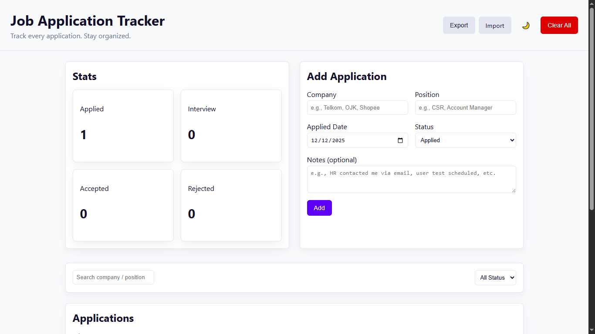
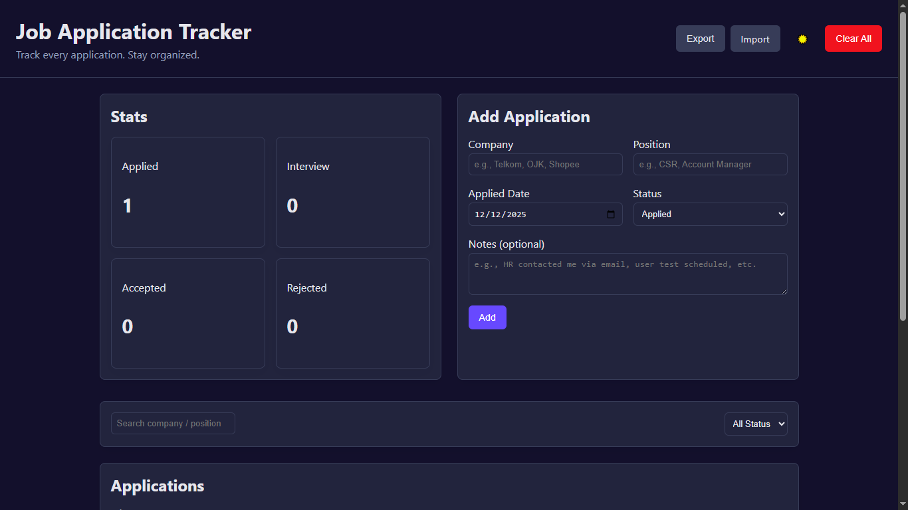

# Job Application Tracker

Web application untuk **mencatat, mengelola, dan memantau proses lamaran kerja** secara terstruktur.  
Dibuat untuk membantu fresh graduate maupun job seeker agar tetap rapi, terorganisir, dan fokus selama proses rekrutmen.

---

## ✨ Features

- ✅ **Add / Edit / Delete** job applications
- 🔍 **Search** berdasarkan company atau posisi
- 🏷️ **Filter status** (Applied, Interview, Accepted, Rejected)
- 📊 **Statistics summary** untuk setiap status
- 🌙 **Light & Dark mode** (disimpan di localStorage)
- 💾 **Persistent data** menggunakan LocalStorage
- 📦 **Export & Import JSON** (backup / pindah device)
- 🔔 **Toast notification** (Add, Update, Delete, Clear)
- 📱 **Responsive layout** (desktop & mobile)

---

## 🛠️ Tech Stack

- **HTML5**
- **CSS3** (Flexbox, Grid, CSS Variables)
- **Vanilla JavaScript**
- **LocalStorage**
- **Vercel** (Deployment)

---

## 📸 Screenshots

### Light Mode

### Dark Mode

##

## 🚀 Live Demo

🔗 **Live Demo:**  
_(isi setelah deploy, contoh)_
